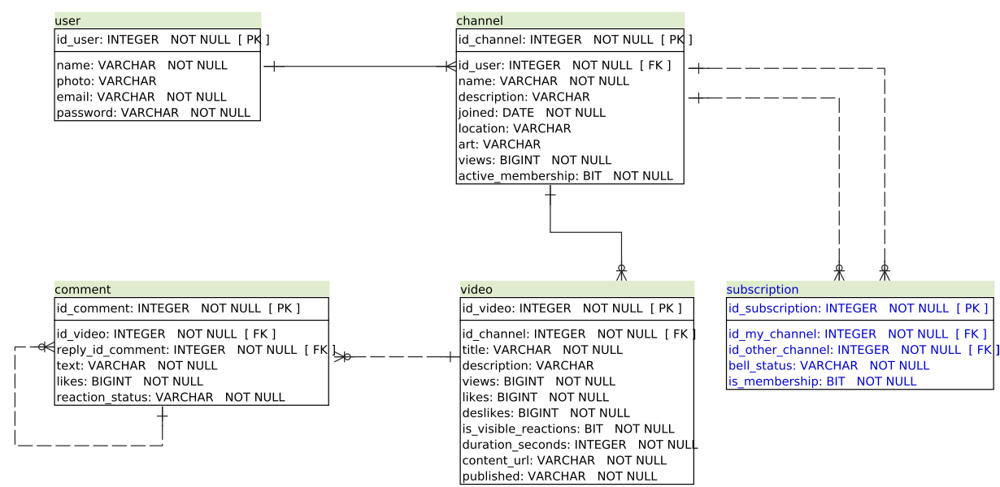
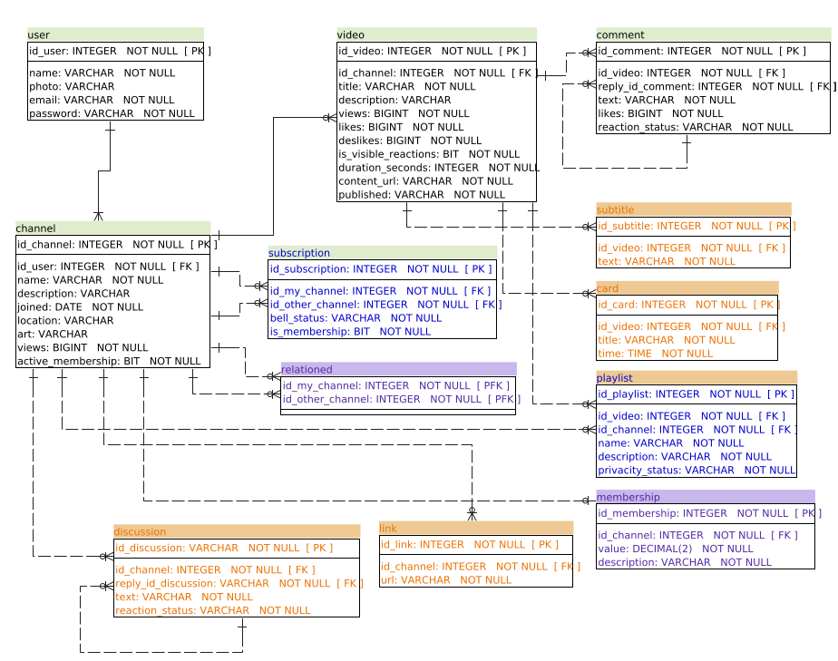

# Yourest

Simulando como seria uma API REST que atende ao frontend do youtube

## Seguindo modelo scrum

Esse projeto é feito baseado no scrum, onde a partir de uma reunião se extrai os requisitos que irão fazer parte da sprint backlog. No sprint backlog foi feita uma priorização dos requisitos para se entregar um mínimo produto viável.

A partir do modelo de negócio proposto - voltar no tempo e imaginar que eu sou o criador do youtube e estou tentando vender essa ideia, foi feita uma análise que resultou em histórias de usuários, do qual se extraiu os requisitos, do qual passou a ser as tarefas planejadas na aba project desse projeto.

Os requisitos mapeados compoem meu product backlog, os selecionados passou a ser a entrega do meu MVP (Mínimo produto viável) do qual é representado na aba project e se tornou uma simulação de sprint backlog.

Aqui se segue tanto as historias de usuários dessa sprint, como as historias de usuário do product backlog geral, assim como o diagrama que será montando nessa sprint, como o diagrama do product backlog geral.

### Link do kanbam com as historias de usuário e processo de priorização do mvp

<https://github.com/Wildrimak/yourest/projects/1#card-44391820>

### Modelo entidade relacionamento dessa sprint backlog

  

### Modelo entidade relacionamento do product backlog

  
